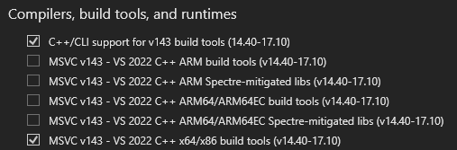

# UE4SS 3.0.0 Git SHA #5319a0e Build Help

## Requirements 

- MSVC 14.38-14.40

    MSVC 14.41 >= Results in compilation errors due to forward declarations in UEPseudo project.
    
    I recommend 14.40, as this repo will be tailored to that specific toolset.
- A computer running Windows.
- Rust toolchain 1.73.0 or greater



[Sign up for Epic UE On Github ](https://www.unrealengine.com/en-US/ue-on-github)

## Build

1. Clone the repo, cd inside.
2. Run 'init_submodules.bat' file.
3. There are two different ways you can generate build files:

    gen.bat -> Normal cmake command to generate VS Solution with MSVC 14.40

    gen_msvcrt_fix.bat -> Cmake generate + remove "/defaultlib:msvcrt" If you experience linking related compilation issues, clear cmake cache and try building with this bat.

4. Open MyMods Solution file and build for Game__Shipping__Win64 (if making mods for VotV)

### Issues

 - _cargo-build_patternsleuth_bind project: ("setlocal" error) post-build event fails to generate, run gen.bat or gen_msvcrt_fix.bat a second time.
 -  defaultlib:msvcrt: use gen_msvcrt_fix.bat

## Making a mod for VotV? [Try libvotv! ](https://github.com/modestimpala/libvotv)

## [Header Dump Converter](DumpConverter.md)

## Easy Mod Generation

Python 3.7> required

### Usage

 Run the script with:
```bash
python generate_mod.py ModName r2modman-profile-name
```

Example:
```bash
python generate_mod.py MyAwesomeMod Default
```

Be sure to re-generate CMake build files via gen bat files after adding new mods.

### Arguments

- `ModName`: Name of your mod (required)
- `profile_name`: Your r2modman profile name (required)
- `--base-dir`: Base directory for the mod (optional, defaults to current directory)

### What it does

1. Clones the [SampleCppMod](https://github.com/modestimpala/SampleCppMod) template
2. Customizes all necessary files with your mod name
3. Sets up correct output paths for r2modman
4. Updates the main CMakeLists.txt to include your mod

### Output Location

Your mod will be built to:
```
C:/Users/%USERNAME%/AppData/Roaming/r2modmanPlus-local/VotV/profiles/[profile-name]/shimloader/mod/[ModName]/dlls
```


#
